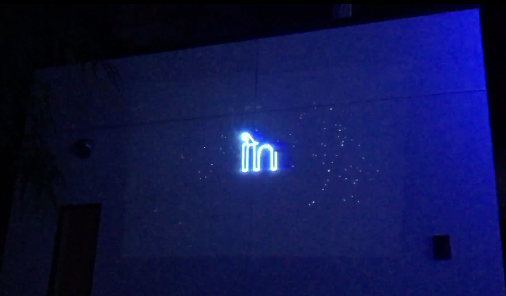

# audio-type-laser

A [Processing](https://processing.org/) sketch that renders text as vector audio signals for oscilloscope/laser display. Made for the **VECTOR HACK Jam** at UCSB MAT, March 2019.

## How it works

- **Geomerative** samples font glyphs into XY point paths
- **XYscope** converts those points into stereo audio — left channel = X axis, right channel = Y axis
- The audio signal physically deflects a laser or oscilloscope beam, drawing the letter shapes in light
- A **Moog filter** with slowly modulated frequency/resonance adds timbral variation
- Text plays back word-by-word, each word's duration proportional to its character count, with punctuation-aware pauses

The text used is Galileo's quote from *Il Saggiatore* (1623):

> *"Philosophy is written in [the universe] which stands continously open to our gaze, but it cannot be understood unless one first learns the language and recognizes the characters in which it is written. It's written in the language of mathematics, and its characters are triangles, circles, and other geometric figures. Without knowledge of this medium, it is impossible to understand a single word of it; without this knowledge, one is wandering about a dark labryinth."*

## Dependencies

- [XYscope](https://teddavis.org/xyscope/) — Processing library for XY audio output
- [Geomerative](http://www.ricardmarxer.com/geomerative/) — vector font rendering
- [Minim](http://code.compartmental.net/minim/) — audio synthesis (included with Processing)
- SoundFlower (macOS virtual audio routing) or equivalent

## Event

**VECTOR HACK Jam & VECTOR SYNTHESIS live performance**
UCSB Media Arts & Technology
1st Thursday, March 7, 2019 — 9pm
SBCAST, 513 Garden Street, Studio F, Santa Barbara CA

A two-week workshop with sound+light artist **Derek Holzer**, sponsored by the MAT Program and the Systemics Public Programming Initiative. Participants used Pure Data and other platforms to generate audio signals that form images when used to control the X/Y movements of a beam of light in an oscilloscope or laser display.

> *VECTOR SYNTHESIS is an audiovisual, computational art project using sound synthesis and vector graphics display techniques to investigate the direct relationship between sound+image. Audio waveforms control the vertical and horizontal movements as well as the brightness of a single beam of light. What is seen and heard are both an expression of the same electronic signal.*
> — Derek Holzer

[MAT@UCSB](https://mat.ucsb.edu) — transdisciplinary graduate program fusing emergent media, computer science, engineering, electronic music and digital art.
